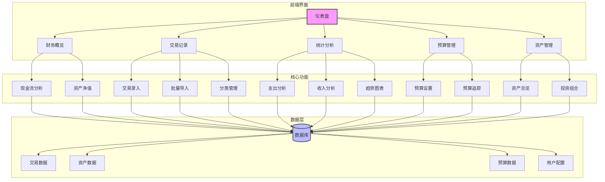

# 家庭理财框架与管理系统

## 1. 核心财务指标

### 1.1 现金流管理

| 指标       | 计算公式                     | 健康标准       | 分析要点                     |
|------------|------------------------------|----------------|----------------------------|
| 月收入     | -                            | 稳定增长       | 主要收入来源及稳定性         |
| 月支出     | -                            | 控制在预算内   | 主要支出类别及优化空间       |
| **储蓄率** | (月收入 - 月支出) / 月收入   | 10-20% 健康区 | 反映财务健康状况             |

### 1.2 资产健康状况

| 指标         | 计算公式           | 健康标准        | 分析要点                     |
|--------------|--------------------|----------------|----------------------------|
| 净资产       | 总资产 - 总负债    | 持续增长        | 资产增长质量与可持续性       |
| 投资资产比率 | 投资资产 / 总资产  | ≥50% 目标      | 资产配置合理性               |
| 流动性比率   | 流动性资产 / 月支出 | 3-6个月        | 应急能力评估                 |
| 财务自由度   | (投资资产 × 年化收益率) / 年支出 | ≥100% 财务自由 | 被动收入覆盖生活支出的能力   |

### 1.3 债务与风险管理

| 指标         | 计算公式           | 健康标准              | 分析要点                     |
|--------------|--------------------|----------------------|----------------------------|
| 资产负债率   | 总负债 / 总资产    | <30% 安全区         | 财务风险水平                 |
| 债务偿还比率 | 月还贷额 / 月收入  | <30% 轻松区         | 还贷压力评估                 |
| 保费支出比率 | 年保费 / 年收入    | 5-15% 合理区间      | 保障充分性评估               |

## 2. 家庭财务文化建设

### 2.1 定期家庭财务会议
- **频率**：每月一次
- **参与人员**：全体家庭成员
- **议程**：
  1. 回顾上月收支情况
  2. 检查预算执行情况
  3. 讨论大额支出计划
  4. 调整财务目标与策略
  5. 学习理财知识（每月一个主题）

### 2.2 财务目标设定
- **短期目标**（1年内）
  - 建立应急基金
  - 偿还高息债务
  - 完成保险配置
- **中期目标**（1-5年）
  - 购房首付
  - 子女教育金储备
  - 职业发展投资
- **长期目标**（5年以上）
  - 退休规划
  - 财富传承
  - 实现财务自由

## 3. 应急基金体系

### 3.1 三层应急资金架构
1. **第一层：基础应急金**
   - 金额：3个月基本生活费
   - 存放：活期存款、货币基金
   - 用途：日常应急、临时支出

2. **第二层：中期储备金**
   - 金额：3-6个月生活费
   - 存放：短期理财产品、债券基金
   - 用途：失业、医疗等突发事件

3. **第三层：长期安全垫**
   - 金额：1年以上生活费
   - 存放：稳健型投资组合
   - 用途：经济危机、长期失业等极端情况

### 3.2 应急基金使用原则
- 专款专用，非紧急不动用
- 使用后及时补充
- 定期评估调整金额

## 4. 收入多元化策略

### 4.1 收入来源规划
1. **主动收入**
   - 主要工作
   - 副业/兼职
   - 自由职业

2. **被动收入**
   - 投资理财收益
   - 租金收入
   - 知识产权收益
   - 数字资产收益

### 4.2 收入多元化目标
- 3年内被动收入占比达到20%
- 5年内建立3个以上稳定收入来源
- 10年内实现财务自由（被动收入 ≥ 生活支出）

## 5. 保险保障规划

### 5.1 必备保险配置
1. **寿险**
   - 保额：年收入5-10倍
   - 期限：至主要责任期结束（如子女独立、房贷还清）

2. **重疾险**
   - 保额：年收入3-5倍
   - 覆盖：常见重疾+轻症

3. **医疗险**
   - 百万医疗险：覆盖大额医疗支出
   - 中高端医疗：提升就医体验

4. **意外险**
   - 综合意外：覆盖意外身故/伤残
   - 交通意外：加强特定场景保障

### 5.2 保险配置原则
- 先保障后理财
- 先大人后小孩
- 先保额后期限
- 定期检视调整

## 6. 投资理财框架

### 6.1 资产配置策略
- **现金类**：5-10%
- **固定收益类**：20-40%
- **权益类**：40-60%
- **另类投资**：5-15%

### 6.2 投资原则
- 长期投资，避免短期投机
- 分散投资，降低风险
- 定期再平衡，维持目标配置
- 费用最小化，提高净收益

## 7. 定期检视与调整

### 7.1 检视频率
- 每月：现金流与预算执行
- 每季：投资组合再平衡
- 每年：全面财务体检
- 重大事件：及时调整规划

### 7.2 调整原则
- 根据生命周期调整风险承受能力
- 根据市场环境调整资产配置
- 根据家庭情况调整财务目标
- 根据政策变化调整税务规划

## 8. 系统功能架构

## 9. 核心模块说明

### 9.1 仪表盘
- 实时财务概览
- 关键指标展示
- 快速操作入口

### 9.2 交易管理
- 交易记录增删改查
- 批量导入导出
- 智能分类
- 交易标签管理

### 9.3 统计分析
- 多维度报表
- 自定义分析
- 数据可视化
- 趋势预测

### 9.4 预算管理
- 预算设置与追踪
- 超支提醒
- 预算执行报告

### 9.5 资产管理
- 资产总览
- 投资组合分析
- 资产配置建议
- 收益追踪

## 10. 财务复盘与追踪

### 10.1 复盘时间安排
- **月度快速复盘**：每月初对上月财务状况进行简要回顾（30分钟）
- **季度深度复盘**：每季度进行全面财务分析（2-3小时）
- **年度总结**：每年底进行全年财务总结与来年规划（半天）

### 10.2 动态管理循环

#### 10.2.1 定期盘点（建议每季度）
- [ ] 更新所有资产和负债的最新数值
- [ ] 重新计算净资产
- [ ] 记录关键财务指标

#### 10.2.2 深度分析（四大核心工具）
- **趋势分析**
  - [ ] 对比上期数据，净资产变化：□ 增长 □ 持平 □ 下降
  - [ ] 变化主因分析：
    - □ 资产增值（如投资增值）
    - □ 债务减少（如提前还贷）
    - □ 收入增加
    - □ 支出减少

- **问题诊断**
  - [ ] 流动性比率：_____（当前） vs 目标：3-6个月
    - 如不足：□ 增加储蓄 □ 调整支出结构
  - [ ] 资产负债率：_____%（当前） vs 目标：<50%
    - 如过高：□ 优先偿还高息债务 □ 暂停新增负债
  - [ ] 储蓄率：_____%（当前） vs 目标：≥20%
    - 如不足：□ 审查预算 □ 优化开支

#### 10.2.3 行动计划制定（SMART原则）
- [ ] 设定1-3个具体财务目标
  - 示例："本季度提前偿还5万元房贷，将资产负债率从55%降至52%"
  - 示例："未来三个月，将应急资金从4个月补充至6个月"
- [ ] 明确执行步骤与时间节点
- [ ] 设定检查点（建议每月）

#### 10.2.4 执行与调整
- [ ] 严格执行预算和计划
- [ ] 每月检查进度
- [ ] 灵活调整策略（如遇重大变化）

### 10.3 复盘检查清单

#### 10.3.1 财务健康度检查
- [ ] 计算当前资产负债率：_____（当前值） vs 目标值：<50%
- [ ] 与上期比较：□ 改善 □ 持平 □ 恶化
- [ ] 主要原因分析：
  - __________________________________________________
  - __________________________________________________

#### 10.3.2 应急能力评估
- [ ] 当前流动性比率：_____（月支出）
- [ ] 应急资金覆盖：_____ 个月
- [ ] 是否需要调整储蓄计划？ □ 是 □ 否
  - 如需要，具体调整方案：
  - __________________________________________________

#### 10.3.3 财富增长分析
- [ ] 本周期储蓄率：_____% （目标：≥20%）
- [ ] 投资收益率：_____% （如适用）
- [ ] 主要收入来源：
  - __________________________________________________
- [ ] 支出异常点：
  - __________________________________________________

#### 10.3.4 债务压力评估
- [ ] 当前偿债比率：_____% （目标：<40%）
- [ ] 债务结构分析：
  - 低息债务（如房贷）：_____ 元
  - 高息债务（如信用卡）：_____ 元

### 10.4 下阶段行动计划

#### 10.4.1 财务目标（SMART原则）
- **具体**：________________________________________
- **可衡量**：______________________________________
- **可实现**：______________________________________
- **相关性**：______________________________________
- **有时限**：______________________________________

#### 10.4.2 具体行动项
1. __________________________________________________
   - 负责人：_________ 完成时间：_________
2. __________________________________________________
   - 负责人：_________ 完成时间：_________

#### 10.4.3 风险预案
- 可能风险：________________________________________
- 应对措施：________________________________________

### 10.5 复盘记录
| 复盘时间 | 主要发现 | 关键决策 | 跟进状态 |
|---------|---------|---------|---------|
|         |         |         |         |

*注：建议将每次复盘记录存档，便于追踪长期趋势和决策效果*
---

*最后更新：2025年11月*
*版本：1.1*